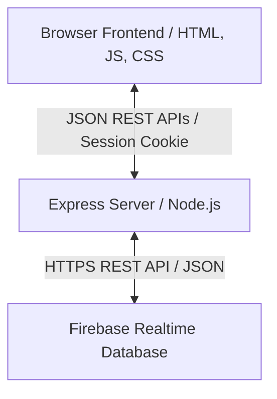
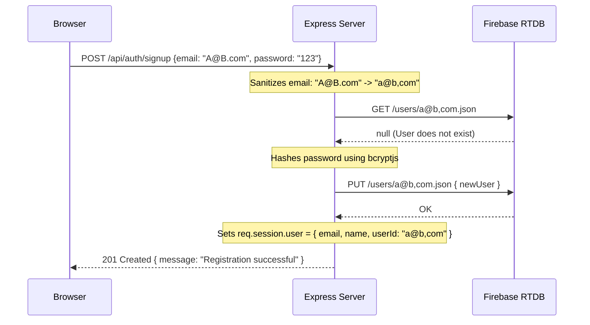
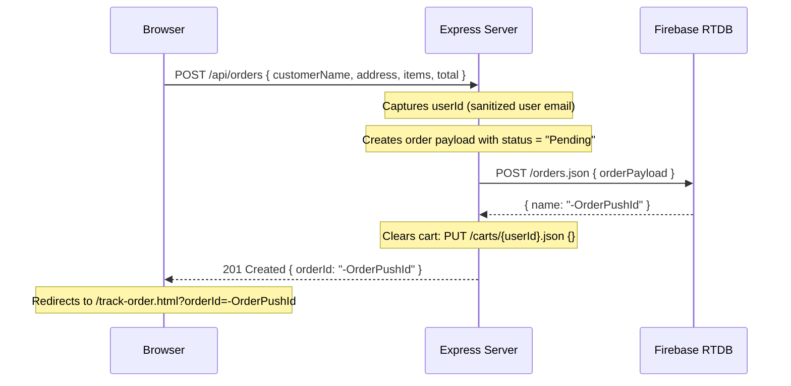

# cookieesandcakes (C&C) - Project Brain & Technical Documentation

This document serves as the **Single Source of Truth** for the `cookieesandcakes` (C&C) codebase. It details the system architecture, REST API endpoints, Firebase database schema, frontend state management, critical workflows, security configurations, technical debt, and operational procedures. It is designed to enable any developer or AI agent to debug, extend, refactor, test, and deploy the system with minimal additional discovery.

---

## 1. System Architecture & Tech Stack

C&C is a full-stack, session-aware e-commerce storefront for an artisanal bakery. It uses a **Client-Server Architecture** with a decoupled frontend and backend that communicate via standard JSON REST endpoints. 

### Technology Stack
*   **Backend Engine**: Node.js & Express.js
*   **Database**: Firebase Realtime Database (REST API Integration)
*   **Authentication & Hashing**: `bcryptjs`
*   **Session Management**: `express-session` (using cookie-based sessions)
*   **Frontend**: Vanilla HTML5, Semantic JavaScript, and CSS via Tailwind CSS (served statically from the `public/` directory).



### Design Philosophy
The system prioritizes **zero-dependency frontend integration** (using Vanilla JS and Tailwind CDN) and a **low-overhead backend** (communicating with Firebase via native Node `https` REST operations rather than the heavy Firebase Admin SDK).

---

## 2. Firebase Database Schema (Data Models)

The backend connects directly to the Firebase Realtime Database REST API at `https://cookieesandcakes-default-rtdb.firebaseio.com/`. All database entries are JSON nodes.

### `/products`
Stores the catalog of bakes. If empty or containing fewer than 5 products on server startup, the database auto-seeds 14 signature treats.
*   **Path**: `/products/${productId}`
*   **Structure**:
    ```json
    {
      "id": "salted-dark-chocolate",
      "name": "Salted Dark Chocolate Cookie",
      "price": 4.50,
      "description": "Thick, chewy, cracked surface showing molten dark chocolate...",
      "category": "cookies",
      "image": "https://lh3.googleusercontent.com/.../img.jpg",
      "unit": "1 piece",
      "tags": ["House Special", "Popular", "Vegan"]
    }
    ```

### `/users`
Stores registered customer accounts.
*   **Path**: `/users/${sanitizedEmail}`
*   **Key Quirk (Sanitization)**: Firebase Realtime Database keys cannot contain dots (`.`). Therefore, user emails must be sanitized by replacing all dots with commas (e.g., `alice.smith@example.com` becomes `alice,smith@example,com`).
*   **Structure**:
    ```json
    {
      "email": "alice.smith@example.com",
      "name": "Alice Smith",
      "phone": "+1234567890",
      "passwordHash": "$2a$10$xyz...",
      "createdAt": 1718873200000
    }
    ```

### `/carts`
Stores active shopping bags for logged-in users. (Guest carts are stored in the server session instead).
*   **Path**: `/carts/${sanitizedEmail}`
*   **Structure**: A map of product IDs to item details:
    ```json
    {
      "salted-dark-chocolate": {
        "productId": "salted-dark-chocolate",
        "name": "Salted Dark Chocolate Cookie",
        "price": 4.50,
        "image": "https://lh3.googleusercontent.com/.../img.jpg",
        "unit": "1 piece",
        "quantity": 3,
        "personalization": "Happy Birthday Alice!"
      }
    }
    ```

### `/wishlists`
Stores favorited bakes for logged-in users. (Guest wishlists are stored in the server session).
*   **Path**: `/wishlists/${sanitizedEmail}`
*   **Structure**: A map of product IDs to item summaries:
    ```json
    {
      "rose-velvet-cake": {
        "productId": "rose-velvet-cake",
        "name": "Rose Velvet Cake",
        "price": 38.00,
        "image": "https://lh3.googleusercontent.com/.../img.jpg",
        "description": "Delicate rose-infused sponge..."
      }
    }
    ```

### `/orders`
Stores order details. Placed orders generate a random Firebase push ID (e.g., `-O12345...`).
*   **Path**: `/orders/${pushId}`
*   **Structure**:
    ```json
    {
      "userId": "alice,smith@example,com", // Or "guest"
      "customerName": "Alice Smith",
      "customerEmail": "alice.smith@example.com",
      "customerPhone": "+1234567890",
      "deliveryDate": "2026-07-10",
      "address": "123 Sugar Lane, Cookie Town",
      "specialInstructions": "Leave on front porch",
      "items": {
        "salted-dark-chocolate": {
          "productId": "salted-dark-chocolate",
          "name": "Salted Dark Chocolate Cookie",
          "price": 4.50,
          "image": "https://lh3.googleusercontent.com/.../img.jpg",
          "unit": "1 piece",
          "quantity": 3,
          "personalization": "Happy Birthday Alice!"
        }
      },
      "total": 18.50,
      "status": "Pending", // Allowed values: Pending, Approved, Preparing, Out for Delivery, Completed, Declined
      "createdAt": 1718873400000
    }
    ```

### `/reviews`
Product reviews submitted by customers. Nested under product ID and identified by Firebase push IDs.
*   **Path**: `/reviews/${productId}/${pushId}`
*   **Structure**:
    ```json
    {
      "userName": "Alice Smith", // Defaults to "Anonymous Cake Lover" if guest
      "rating": 5, // Integer 1-5
      "comment": "Molten chocolate centers were perfect!",
      "createdAt": 1718873500000
    }
    ```

---

## 3. REST API Documentation

All API endpoints reside on the main Express app. Endpoints consume and produce `application/json`.

### 1. Authentication
*   **POST `/api/auth/signup`**
    *   *Payload*: `{ email, password, name, phone }` (Name, email, password are required)
    *   *Behavior*: Sanitizes email (`.` -> `,`). Checks if user exists. Hashes password using bcrypt. Saves user profile to Firebase. Establishes active user session.
    *   *Response*: `201 Created` with user session object.
*   **POST `/api/auth/login`**
    *   *Payload*: `{ email, password }`
    *   *Behavior*: Sanitizes email. Fetches user from Firebase. Compares password hashes. Establishes active session.
    *   *Response*: `200 OK` with user session object.
*   **GET `/api/auth/session`**
    *   *Behavior*: Checks current session context.
    *   *Response*: `{ loggedIn: true, user: { email, name, phone, userId } }` or `{ loggedIn: false }`.
*   **POST `/api/auth/profile`** (Requires active session)
    *   *Payload*: `{ name, phone }`
    *   *Behavior*: Updates user parameters in Firebase and updates active session.
    *   *Response*: `200 OK` with updated session.
*   **POST `/api/auth/logout`**
    *   *Behavior*: Destroys active session.
    *   *Response*: `200 OK`.

### 2. Products API
*   **GET `/api/products`**
    *   *Query Params*: 
        *   `category`: `cookies` | `cakes` | `pastries` | `all`
        *   `search`: Search string (filters by name and description, case-insensitive)
        *   `sort`: `low-high` | `high-low`
    *   *Response*: Array of product objects.
*   **GET `/api/products/:id`**
    *   *Response*: Details of specified product. Returns `404` if not found.

### 3. Shopping Cart Management
*   **GET `/api/cart`**
    *   *Behavior*: Fetches cart for active session. Reads from Firebase `/carts/${userId}` if logged in; otherwise reads from `req.session.cart`.
    *   *Response*: Cart items map.
*   **POST `/api/cart`**
    *   *Payload*: `{ productId, quantity, personalization }`
    *   *Behavior*: Adds or increments item in active cart (DB or session). Saves personalization notes.
    *   *Response*: Updated cart items map.
*   **POST `/api/cart/update`**
    *   *Payload*: `{ productId, quantity, personalization }`
    *   *Behavior*: Sets item quantity or updates personalization. If `quantity <= 0`, removes item.
    *   *Response*: Updated cart items map.
*   **POST `/api/cart/delete`**
    *   *Payload*: `{ productId }`
    *   *Behavior*: Deletes item from cart.
    *   *Response*: Updated cart.

### 4. Wishlist Management
*   **GET `/api/wishlist`**
    *   *Behavior*: Fetches wishlist from database `/wishlists/${userId}` (if logged in) or `req.session.wishlist` (if guest).
    *   *Response*: Wishlist items map.
*   **POST `/api/wishlist/toggle`**
    *   *Payload*: `{ productId }`
    *   *Behavior*: Toggles inclusion of the product in the wishlist.
    *   *Response*: `{ wishlist, status: 'added' | 'removed' }`.

### 5. Checkout & Orders
*   **POST `/api/orders`** (Requires active session)
    *   *Payload*: `{ customerName, customerEmail, customerPhone, deliveryDate, address, specialInstructions, items, total }`
    *   *Behavior*: Creates a new order node under `/orders` via `POST`. Clears user's database cart. Returns `401 Unauthorized` if no active session is found.
    *   *Response*: `201 Created` with `{ message, orderId }` or `401 Unauthorized`.
*   **GET `/api/orders`**
    *   *Behavior*: Returns order history for current logged-in user. Filters by `userId === session.userId`. Returns empty array for guest.
    *   *Response*: Array of orders sorted by `createdAt` descending.
*   **GET `/api/orders/:id`**
    *   *Behavior*: Fetches tracking info and items for a specific order. (Publicly readable).
    *   *Response*: Order details.

### 6. AI Chat Assistant (Baker Bot)
*   **POST `/api/chat`**
    *   *Payload*: `{ message, history }` (both optional; `message` is required otherwise `400`).
    *   *Behavior*: Single shared assistant powering the chat widget on every page. Conversation context is kept in `req.session.chatHistory` (capped at 30 turns) so the agent is continuous. If `CHAT_API_URL` + `CHAT_API_KEY` are set in `.env`, it delegates to that OpenAI-compatible model; otherwise it uses the built-in knowledge engine (product catalog, store hours, shipping, account/order help). The frontend widget (`public/js/chatbot.js`) self-injects on all pages and persists the conversation in `localStorage` so the one agent follows the user across pages.

### 7. Reviews & Ratings
*   **POST `/api/reviews`**
    *   *Payload*: `{ productId, rating, comment, userName }` (Rating must be 1-5)
    *   *Behavior*: Posts review under `/reviews/${productId}`.
    *   *Response*: `201 Created` with review object.
*   **GET `/api/reviews/:productId`**
    *   *Response*: Array of reviews for the product, sorted by `createdAt` descending.

---

## 4. Frontend State & Controller Layer

The frontend is served from `/public` as static HTML and JavaScript assets. It uses a single global namespace `window.App` defined in `app.js` to coordinate session, cart, and wishlist states.

### State Controller Modules (`/public/js/`)

1.  **[app.js](file:///c:/Users/AZMIYA AAYAT/Downloads/candc/public/js/app.js)**: 
    *   Defines `window.App` state: `user`, `cart`, `wishlist`.
    *   Wraps `fetch` in `fetchAPI()` with JSON content headers and global error handling.
    *   Implements session validation (`checkSession`) and profile redirections.
    *   Synchronizes and updates the global cart count badge (`header-cart-badge`) and global wishlist icon fills (`favorite`).
2.  **[auth.js](file:///c:/Users/AZMIYA AAYAT/Downloads/candc/public/js/auth.js)**:
    *   Contains logic for signin.html (primary sign-in page), login.html (fallback/legacy), signup.html, reset-password.html, and account.html.
    *   Listens to login/signup form submittals and issues requests to `/api/auth/login` or `/api/auth/signup`.
    *   Updates the `account.html` dashboard (injecting order history, welcome greetings, and wishlists).
3.  **[cart.js](file:///c:/Users/AZMIYA AAYAT/Downloads/candc/public/js/cart.js)**:
    *   Loads and renders the shopping bag items.
    *   Attaches event listeners to quantity selectors (`+` / `-`) and deletion buttons.
    *   Handles checkout step: hides cart list and overlays the "Delivery Details" form to compile and POST the order.
4.  **[orders.js](file:///c:/Users/AZMIYA AAYAT/Downloads/candc/public/js/orders.js)**:
    *   Builds lists in `order-history.html`.
    *   Controls `track-order.html`: updates the delivery timeline nodes and controls the coordinates of the delivery truck on the SVG canvas.
    *   Coordinates product rating submittals in `rate-treats.html`.
5.  **[product.js](file:///c:/Users/AZMIYA AAYAT/Downloads/candc/public/js/product.js)**:
    *   Manages detail views (`treat-salted-dark-chocolate.html` and `treat-double-truffle-signature-cake.html`).
    *   Pulls and averages review ratings, displaying them as filled stars.
    *   Updates bento layout cells in `wishlist.html`.
6.  **[treats.js](file:///c:/Users/AZMIYA AAYAT/Downloads/candc/public/js/treats.js)**:
    *   Loads catalog listing dynamically from `/api/products`.
    *   Toggles active categories (Cookies, Cakes, Pastries).
    *   Dynamically injects a search bar into the page header.
    *   Controls catalog sorting selector parameters.

### UI Styling & Custom Tailwind Rules
Styling is configured inside the `<script id="tailwind-config">` block in HTML headers. Extended design tokens include:
*   **Brand Colors**:
    *   `primary` (`#44281e`): Dark roasted coffee tone used for text and headings.
    *   `secondary` (`#91494d`): Dusty rose/warm maroon tone used for CTA buttons and highlights.
    *   `background` (`#fff8f6`): Soft creamy linen.
    *   `surface-container` (`#ffe9e2`): Toasted almond accent.
*   **Typography**:
    *   Serifs (`Libre Caslon Text`): Used for product headers and bakery brand.
    *   Sans-serif (`Be Vietnam Pro`): Readable body copies.
    *   Cursive (`Great Vibes`): Specifically loaded in `personalize.html` for handwritten gift card simulations.
*   **Elevation**:
    *   `butter-shadow`: Custom shadow token `0 20px 40px rgba(93, 62, 51, 0.08)` designed for smooth depth blending on cream backgrounds.

---

## 5. Critical System Workflows & Sequences

### 1. User Registration & Sanitization


### 2. Checkout & Fulfillment Lifecycle
Orders transition through a clear status state machine:
`Pending` $\rightarrow$ `Approved` $\rightarrow$ `Preparing` $\rightarrow$ `Out for Delivery` $\rightarrow$ `Completed` (or `Declined`).



### 3. Order Tracking State Machine (Visual Coordinate System)
The moving truck coordinate system on the SVG map is defined dynamically in `orders.js`:

| Order Status | Truck Left (%) | Truck Bottom (%) | Current Map Location Description |
| :--- | :--- | :--- | :--- |
| **Pending** | `10%` | `15%` | "Awaiting checkout confirmation" |
| **Approved** | `25%` | `25%` | "Order approved by baking team" |
| **Preparing** | `45%` | `40%` | "Treats are in the oven" |
| **Out for Delivery** | `70%` | `30%` | "Out for delivery with Sweet Courier" |
| **Completed / Delivered** | `85%` | `20%` | "Delivered warm and sweet!" |

---

## 6. Technical Debt, Security Risks & Maintenance

### 1. Hardcoded Secrets & Configuration (Resolved)
*   **Status**: Successfully migrated to environment variables using `dotenv`.
*   **Variables**: `PORT`, `SESSION_SECRET`, and `FIREBASE_URL` are defined in the project `.env` file and loaded dynamically in `server.js`.
*   *Note*: The `.env` file is untracked via `.gitignore` to prevent secret exposure.

### 2. Public Tracking Exposure (Privacy Risk)
*   **Route**: `GET /api/orders/:id`
*   *Vulnerability*: This endpoint fetches and returns the full details of any order (including `customerName`, `customerEmail`, `customerPhone`, `address`, `items`, and `total`) to any client that queries it. There is **no authorization check** matching the order's `userId` with the active session user.
*   *Fix*: Validate that `session.user.userId === order.userId` before returning data, or sanitize guest orders to remove sensitive fields when accessed anonymously.

### 3. Session Store Volatility (Operational Debt)
*   **Engine**: `express-session` default memory store (`MemoryStore`).
*   *Implication*: Because sessions are stored in Express process memory, restarting the Node server kills all active shopping carts (for guests) and logs out all users.
*   *Fix*: Integrate a persistent session store like `connect-redis` or `connect-mongo`.

### 4. Client-side Product Catalog Mappings (Maintenance Risk)
*   Only two product details pages exist as static files:
    *   `salted-dark-chocolate` $\rightarrow$ `treat-salted-dark-chocolate.html`
    *   `double-truffle-signature-cake` $\rightarrow$ `treat-double-truffle-signature-cake.html`
*   Other products default to `/treats.html` without unique details views. Adding a new detail page requires creating a static HTML file and updating mappings in `public/js/product.js`.
*   *Fix*: Refactor product views to use a single dynamic template file (e.g., `/product.html?id=productId`) that fetches details from `/api/products/:id` and renders dynamically.

---

## 7. Verification & Run Commands

### Development Setup
Ensure dependencies are installed:
```powershell
npm install
```

Start the application locally:
```powershell
npm run dev
```
The server will boot up and bind to `http://localhost:3000`.

### Database Verification
When the server starts, it logs:
*   `Checking database products...`
*   `Products already populated in database. Skipping seed.` (If database is populated) OR
*   `Seeding signature products into Firebase Realtime Database...` $\rightarrow$ `Products successfully seeded!` (If database is empty)
