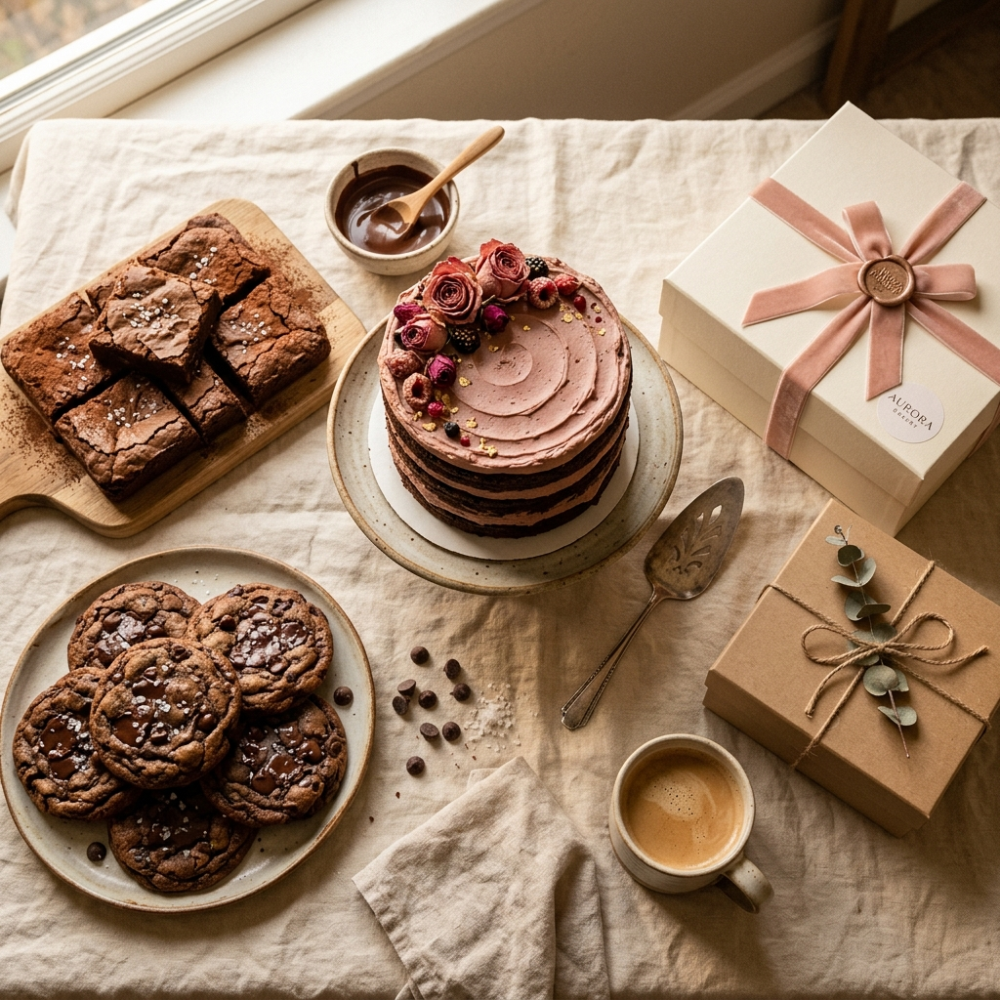

# 🍪 cookieesandcakes



A beautiful, handcrafted, artisanal static website for a small-batch bakery business. Designed to feel like a warm hug, featuring a cozy color palette, smooth animations, and a focus on visual appeal.

**[Live Preview](https://cookieesandcakes.vercel.app/)** (If deployed)

---

## ✨ Features

- **Responsive Design**: Mobile-first architecture ensuring the site looks stunning on phones, tablets, and desktops.
- **Dynamic Product Data**: All menu items are rendered dynamically from a single `products.json` file. Updating the menu is as simple as editing a text file.
- **Filterable Menu**: Smooth, animated filtering logic to easily switch between Cookies, Cakes, Brownies, and Gift Boxes.
- **Masonry Image Gallery**: A clean gallery layout equipped with a keyboard-navigable, full-screen lightbox.
- **Testimonial Carousel**: Touch-friendly slider for customer reviews.
- **Client-Side Form Validation**: Real-time validation for the custom order form before sending to Formspree.
- **SEO & Performance**: Configured with `sitemap.xml`, `robots.txt`, Open Graph tags, lazy-loaded images, and CSS animations using `IntersectionObserver`.

---

## 🛠️ Tech Stack

- **HTML5**: Semantic, accessible markup.
- **CSS3 (Vanilla)**: Custom CSS design system using native variables (`tokens.css`). No heavy frameworks like Bootstrap or Tailwind, resulting in a lightweight footprint.
- **JavaScript (Vanilla)**: Modular ES6 components (`js/`) for gallery logic, form validation, menu filtering, and scroll animations.
- **Formspree**: Simple form processing for the custom order inquiries without needing a backend server.
- **Vercel**: Pre-configured (`vercel.json`) for seamless zero-config deployment.

---

## 📁 Project Structure

```text
cookieesandcake/
├── index.html            # Home page
├── menu.html             # Product catalog with filter
├── about.html            # Brand story and values
├── gallery.html          # Masonry grid & lightbox
├── order.html            # Contact & custom order form
├── 404.html              # Custom error page
├── vercel.json           # Vercel deployment config
├── sitemap.xml           # SEO sitemap
├── robots.txt            # Search engine directives
├── data/
│   └── products.json     # 📝 Edit this file to update the menu!
├── js/
│   ├── animations.js     # Scroll reveal effects
│   ├── filter.js         # Menu category switching
│   ├── form.js           # Formspree submission & validation
│   ├── gallery.js        # Lightbox logic
│   ├── navbar.js         # Mobile drawer & sticky state
│   ├── products.js       # JSON fetching & rendering
│   └── testimonials.js   # Carousel slider
├── styles/
│   ├── tokens.css        # Core design variables (colors, fonts)
│   ├── global.css        # Base layout & typography
│   ├── ...               # Component-specific styles
└── assets/
    └── images/           # Placeholder AI bakery images
```

---

## 🚀 Running Locally

You don't need Node.js, Webpack, or any build tools to run this site. 

1. Clone the repository:
   ```bash
   git clone https://github.com/azmi2605/cookieesandcakes.git
   cd cookieesandcakes
   ```
2. Start a local server (if you have Python installed):
   ```bash
   python -m http.server 5500
   ```
   Or use the **Live Server** extension in VS Code.
3. Open `http://127.0.0.1:5500` in your browser.

---

## 🌐 Deployment (Vercel)

This project is configured specifically for 1-click deployment to [Vercel](https://vercel.com).

1. Log into Vercel and create a **New Project**.
2. Import this GitHub repository.
3. Vercel will automatically detect the static setup and apply the security headers from `vercel.json`.
4. Click **Deploy**.

---

## 📝 Setup Checklist for the Owner

Before sharing your new site with customers, make sure you complete these steps:

- [ ] **Update Logo**: Replace the inline SVG logo in all HTML files with an `` tag pointing to your real logo.
- [ ] **Swap Images**: Replace the placeholder images in `assets/images/` with actual photos of your beautiful bakes. Keep the filenames or update `data/products.json` and the HTML files.
- [ ] **Update Links**: Add your real Instagram, Facebook, email, and phone number to the footer and `order.html` page.

---

*Baked with 🤎 using HTML, CSS, and JS.*

Made by [Azmiya Aayat](https://github.com/azmi2605)
